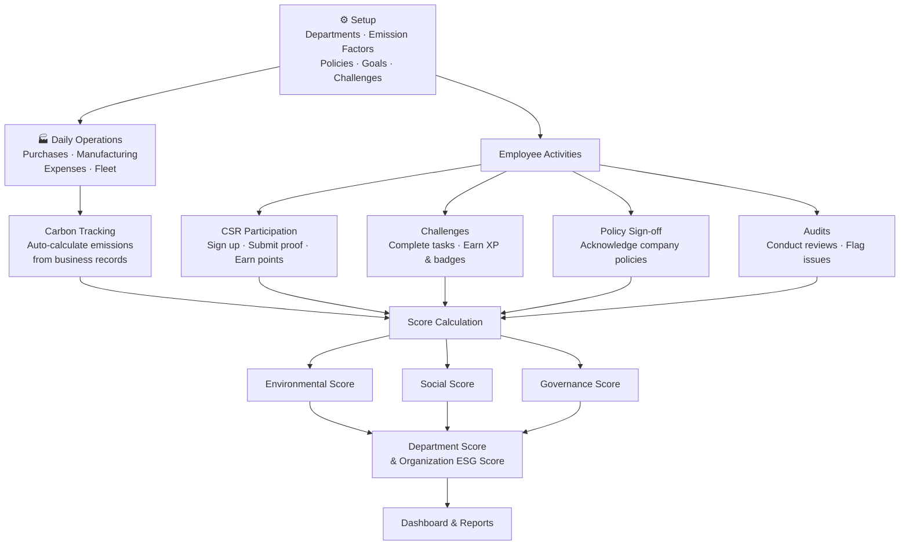

# 🌍 EcoSphere — ESG Management Platform

**Track your company's environmental impact, social initiatives, and governance compliance — all in one place.**

---

## What is this?

EcoSphere helps organizations answer three simple questions:

1. **Environmental** — How much carbon are we producing, and are we reducing it?
2. **Social** — Are our employees engaged in community and well-being initiatives?
3. **Governance** — Are we following our own policies and passing audits?

Instead of scattered spreadsheets and manual reports, EcoSphere connects directly to your existing business operations and turns raw data into actionable sustainability scores.

---

## How it works



---

## Key Features

| Module | What it does |
|---|---|
| **Environmental** | Tracks carbon emissions, sets reduction goals, monitors progress |
| **Social** | Manages community activities, tracks employee participation and diversity |
| **Governance** | Handles policies, audits, and compliance issues |
| **Gamification** | Challenges, XP, badges, rewards, and leaderboards to keep people engaged |
| **Reports** | Pre-built and custom reports with PDF/Excel/CSV export |

---

## Scoring

Every department gets three scores (Environmental, Social, Governance) that roll up into one **Organization ESG Score**.

Default weighting:
- Environmental — **40%**
- Social — **30%**
- Governance — **30%**

Weights are configurable per organization.

---

## Project Structure

```
EcoSphere-ESG-Management-Platform/
├── docs/
│   └── PRD.md              # Detailed product requirements
├── README.md                # You are here
└── ...                      # Source code (coming soon)
```

---

## Documentation

- [**Product Requirements Document (PRD)**](docs/PRD.md) — Full specification including data models, business rules, workflows, and reporting requirements.

---

## License

This project is for educational and evaluation purposes.