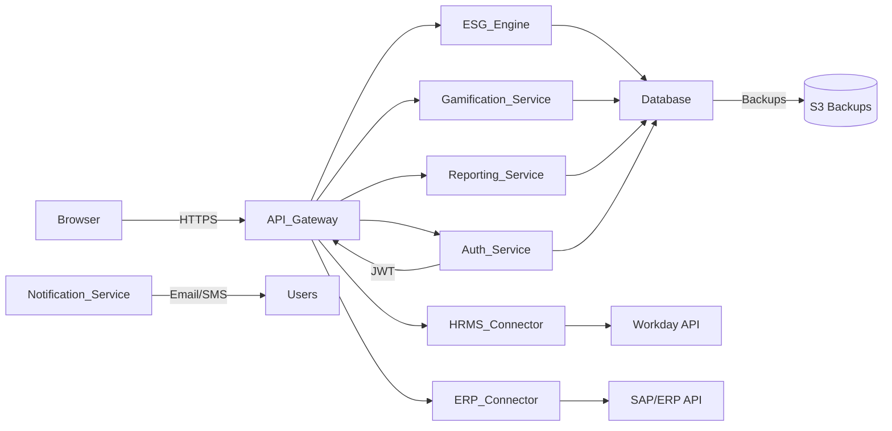

# Executive Summary  
An autonomous engineering agent must design and build an **Enterprise ESG Management System** (ERP-grade) for the hackathon-provided “EcoSphere ESG Platform” problem.  This report delivers a comprehensive prompt: it specifies the system’s mission, success criteria, modules with submodules and workflows, UI screens, data models, APIs, ESG score engine, gamification, environmental accounting, social/governance processes, reporting, notifications, security, integrations, testing, DevOps, non-functional requirements, deliverables, timeline, and acceptance criteria.  It is intended as a step-by-step blueprint that leaves no functionality unspecified.  Where relevant, industry best practices and standards are cited (e.g. OWASP for security, REST API design, testing pyramid, containerization, and data management).  

## Mission, Success Criteria, Constraints, Assumptions  

**Mission:** Design and implement **EcoSphere** – an ERP-integrated ESG Management Platform. The agent’s goal is a production-ready web application (multi-tenant SaaS) that enables enterprises to track, score, and improve their Environmental, Social, and Governance performance. Core functions include data collection/ingestion, ESG scoring, user engagement (gamification), reporting, and compliance workflows. The system must integrate with existing ERP/HR systems and support key user roles (employees, managers, admins, auditors, etc.). 

**Success Criteria:** Deliverables include codebase with CI/CD pipeline, database, APIs, front-end/UI wireframes, documentation, test suite, deployment scripts, and a working demo. The system will be judged by completeness (all modules implemented), correctness (business rules enforced), security (OWASP Top10 compliance), performance (meeting SLA targets), and user experience (usable UI, clear workflows).  

**Constraints:** Use open-source or freely available technologies (e.g. Node.js, Java/Spring, or Python/Django, React/Vue). Ensure multi-tenancy (isolated data per tenant). Follow regulatory standards (e.g. GHG Protocol for emissions, GDPR for PII). All integrations and APIs must use secure protocols (HTTPS, OAuth2). 

**Assumptions:** The provided problem statement defines scope; any unspecified details (e.g. exact emission factors) are to be handled generically or configurable. The system is cloud-hosted. We assume access to an ERP (e.g. SAP/Oracle) and HRMS (e.g. Workday) via APIs. We assume standard environmental conversion factors (GHG Protocol, EPA). 


## Modules & Submodules  

| Module                    | Submodules/Features                              | Purpose                                                                                     |
|---------------------------|--------------------------------------------------|---------------------------------------------------------------------------------------------|
| **1. Authentication & Access** | User login (username/password), SSO/OAuth2 (SSO integration), Password reset, Role-Based Access Control (RBAC) | Secure user login, account management, enforce roles/permissions (e.g. employee, manager, admin). |
| **2. Master Data & Admin**   | Master data (tenant, departments, locations, assets, emissions factors), User/Role management, Feature toggles, Settings | Manage core reference data (e.g. company, locations, cost centers), user accounts, and configuration. Support multi-tenancy (each tenant’s data isolated, e.g. via `tenant_id`). |
| **3. Dashboard & Profiles**    | Admin Dashboard, Manager Dashboard, Employee Dashboard, Department Score views, Personal Profile | Provide overviews of ESG metrics and tasks. Dashboards aggregate scorecards, trends, alerts. Employee/manager dashboards show individual contributions and team stats. |
| **4. Environmental (E)**    | Emissions Tracking (CO₂, water, waste), Auto-calculation (energy, fuel, expenses), Emission Factors config, Unit Conversions, Reporting | Track environmental metrics. Ingest ERP/IoT data (e.g. energy usage, fuel receipts) and apply emission factors to compute emissions. Handle unit conversions (e.g. kWh to MWh). Provide CRUD for factors and manual data corrections. |
| **5. Social (S)**           | CSR Initiatives & Events, Employee Training/Credits, Diversity Metrics, Policy Acknowledgement workflows, Audits | Track social metrics: CSR event participation, training completion, diversity targets. Manage HR/CSR tasks (e.g. schedule events, assign training). Policy acknowledgment: distribute policies, collect signed acknowledgements with audit log (versioned docs, remind non-respondents). |
| **6. Governance (G)**       | Policies & Procedures, Compliance Issues (Ticketing), Audit Records, Reminders & Escalations | Manage governance: define/edit policies, track compliance tickets (e.g. incidents, corrective actions) through lifecycle (open→investigating→resolved). Schedule audits, log findings, send reminders on deadlines. |
| **7. ESG Scoring Engine**   | Configurable Weighting (E:S:G), Metric Formulas, Tiered Scorecards, Audit Trail | Compute ESG scores for individuals, departments, and company. Allow admins to configure category weights (e.g. 40% E, 30% S, 30% G). Define formulas (e.g. department_score = weighted sum of submetrics). Trigger recalculation on data update. Log all score changes for audit. |
| **8. Gamification**         | XP Rules & Levels, Badges/Achievements, Leaderboards (employee & department), Rewards Catalog, Redemption Workflow | Engage users: award XP for ESG activities (completed tasks, trainings, sustainability contributions). Define levels and milestone badges (e.g. “Carbon Cutter” for 10 emissions reduction actions). Leaderboards rank users and teams by XP. Manage virtual rewards: catalog, points redemption, tracking. Include anti-fraud checks (e.g. limit points per action, ensure submissions vetted). |
| **9. Reporting & Exports**  | Pre-built Reports (ESG summary, environmental, social, governance), Custom Report Builder, Export (CSV/XLSX/PDF), Schedule/Email Reports | Provide reports/dashboards. Reports with filters (by date range, dept). Layout templates for PDF/Excel exports (using libraries like JasperReports or Apache POI). Scheduled reports by email.   |
| **10. Notifications**       | Channels (Email, SMS, In-app), Templates, Throttling/Frequency Caps, User Preferences | Send alerts (policy reminders, score updates, approvals, rewards). Manage templates for each channel. Implement batching and capping (e.g. ≤10/day) to avoid fatigue. Allow users to choose channels and opt-in/out. Include unsubscribe links in emails. |
| **11. Settings & Tenant Admin** | Tenant Signup, Company Profile, Master Data (units, currencies), Feature Flags | Tenant-level settings. Manage master data lists (departments, cost centers, measurement units). Feature toggles for beta features. Support multi-tenancy: per-tenant partitioning (e.g. `tenant_id` on records). |
| **12. Security & Compliance** | RBAC definitions, Encryption keys, Audit Logs, Data Retention Policy | Enforce OWASP security (e.g. input validation, auth checks). Encrypt sensitive data, hash passwords. Maintain access logs for PII and score changes. Apply data retention (e.g. purge PII after retention period, “right to be forgotten” compliance) in line with GDPR/CCPA. |
| **13. Integrations**       | ERP (e.g. SAP/Oracle), HRMS (e.g. Workday, BambooHR), SSO (OAuth2/SAML), Email/SMS gateways, Cloud Storage, BI/Analytics APIs | Pull data and push updates via APIs. Use OAuth2 for ERP/HRMS (Workday uses OAuth2 per tenant). For SSO, support Okta/ADFS/SAML login. Email via SMTP or service. Cloud storage (AWS S3, Azure) for attachments. BI: e.g. connect to Tableau/PowerBI. |
| **14. Testing**            | Unit Tests, Integration Tests, E2E Tests, Load/Performance Tests, Acceptance Tests | Implement test suite following the *test pyramid*: ~70% unit tests, 20% integration tests, 10% E2E. Write test cases for all business rules (see each module). Define pass criteria (100% critical tests). Run tests on CI. |
| **15. DevOps & Infrastructure** | CI/CD Pipeline, Containerization (Docker/K8s), Infra Diagram, Backups, Monitoring, Logging, Deployment Checklist | Continuous Integration and Deployment with pipeline stages (build/test/deploy). Use trunk-based development (short branches). Containerize services; follow best practices (pin image tags, no root, resource limits). Diagram components (web app, DB, API gateway). Implement automated backups, monitoring (Prometheus/Grafana), central logs (ELK stack). |
| **16. Non-Functional**     | Scalability, Performance, Availability (SLA), Data Volume Estimates | Architect for scalability: use load balancers, scale horizontally; database indexing and caching. Define performance targets (e.g. page load <2s, API <300ms). Aim for high availability (e.g. 99.9% uptime). Estimate data growth (e.g. N tenants × M records/day). |
| **17. Delivery & Timeline** | Milestones (architecture design, MVP, alpha, beta, final), Sprints, Owners | Schedule phases: e.g. Sprint1: Core modules (Auth, MasterData); Sprint2: Environmental + Social; Sprint3: ESG engine + Gamification; Sprint4: Reporting + Notifications; Sprint5: Testing/DevOps; Sprint6: Documentation & Buffer. Assign team roles (lead dev, front-end, QA). Provide Gantt or timeline table.   |
| **18. Acceptance & Demos** | Judge Criteria, Demo Scenarios, Success Metrics | Define hackathon demo scenarios: e.g. “Employee logs an emission entry → score updates → manager views dashboard, approves points” (should complete smoothly). Include acceptance checklists for each module (login works, data saved/validated). Prepare criteria for scoring (completeness, UX, performance). |

## Module Details  

### 1. Authentication & Access  
- **Purpose:** Secure login and user management.  
- **User Roles:** Tenant Admin, Sustainability Manager, Employee, Auditor, (and an automated “System” role for APIs).  
- **UI Screens (wireframe):** Login page (username, password); Forgot Password; SSO button (e.g. “Login with Okta”); Two-Factor Auth (optional). Admin user management: User list (CRUD), Role assignment.  
- **APIs/CRUD:**  
  - `POST /api/v1/auth/login` (credentials) → JWT token.  
  - `POST /api/v1/auth/logout`.  
  - `POST /api/v1/auth/refresh` (refresh token flow).  
  - User CRUD (`/api/v1/users`): Admins can CREATE/READ/UPDATE/DELETE users. Fields: `username, email, password_hash, first_name, last_name, role, tenant_id`. Validate: email format, password strength. No duplicate emails per tenant. Passwords hashed (bcrypt).  
- **Validation/Rules:**  
  - Strong password rules.  
  - Lock account after N failed attempts (e.g. 5).  
  - Enforce HTTPS for all auth calls.  
- **Workflow:** New user creation requires admin approval/email verification. SSO flow must register first-time users with default Employee role. JWT tokens carry `role` claim; middleware enforces RBAC.  
- **Edge Cases:** Inactive user cannot login; expired password reset tokens; token expiry handling (401 errors).  
- **Acceptance:** Only valid users can obtain tokens; RBAC enforced on sensitive endpoints; JWT includes tenant_id and role; bearer tokens used; rate-limit login attempts (e.g. 100 req/hr).  

### 2. Master Data & Admin  
- **Purpose:** Manage reference data that underpins all modules, and global settings.  
- **User Roles:** Tenant Admin, Sustainability Manager.  
- **UI Screens:** Tenant settings page (company name, logo, fiscal year); Master data editors: Location list, Department list, Asset list, Unit of measure, Emission factor table. Role/Permission management panel; Feature toggle panel (on/off switches).  
- **CRUD Operations:**  
  - Departments, Locations, Cost Centers: name, code, parent dept, tenant_id.  
  - Emission Factors: category (e.g. Electricity, Diesel, AirTravel), factor value (e.g. kgCO₂/kWh), units, source reference.  
  - Policies: Titles, text, version.  
- **Business Rules:** Master data entries require unique codes. Changing a factor triggers recalculation flag on related emissions. Tenant isolation: every master record linked to `tenant_id`.  
- **Workflows:** Only Admin can modify master lists. Changing a company logo/icon updates tenant branding.  
- **Acceptance:** All master records CRUD-able by admin; no cross-tenant visibility; master data edits log user/time.

### 3. Dashboard & Profiles  
- **Purpose:** Give users at-a-glance ESG metrics and tasks.  
- **User Roles:** All.  
- **UI Screens:**  
  - **Admin Dashboard:** Key company-wide KPIs (overall ESG score, recent trends, open compliance issues), quick stats (avg. dept scores), notifications.  
  - **Manager Dashboard:** Team performance charts (bar chart of team members’ scores), open tasks (pending policy acknowledgments, compliance tickets).  
  - **Employee Dashboard:** Personal ESG score, earned badges, upcoming CSR events, notifications.  
  - **Department View:** For managers: list of departments with their scores (colored tiles).  
  - **Personal Profile:** User details, role, XP points, badges.  
- **Operations:** Read-only charts and lists (no complex CRUD here).  
- **Workflows:** Data is pulled from ESG engine outputs. Each dashboard has filters (date range, category).  
- **Acceptance:** Dashboard data refresh on page load, reflects latest state. Layout is responsive. Key fields: score values, chart labels. All numbers validated (>=0, <=100%). 

### 4. Environmental (E) Module  
- **Purpose:** Track and report environmental impacts (emissions, energy, water, waste).  
- **Roles:** Sustainability Manager, Employees (submit data), Auditor.  
- **UI:**  
  - **Data Entry Forms:** e.g. “Log Fuel Usage” (date, fuel type dropdown, quantity, unit). “Record Energy Meter” (kWh).  
  - **Summary Screens:** Graphs of emissions by category over time, breakdown (Scope 1 vs 2 vs 3).  
  - **Emission Factors Table:** (See Master Data).  
- **CRUD:**  
  - **Transactions:** purchase orders (if pulling from ERP: auto-import with Supplier, COA code, amount), expenses (from finance). In manual entry mode: date, description, quantity, unit.  
  - **Validation:** Units consistent (e.g. convert liters to kg using density if needed). Mandatory: date ≤ today. Factor lookup by category.  
- **Business Rules:** Emissions auto-calc: emission = quantity × factor. For example, 1000 kWh (electricity) × 0.233 kgCO₂/kWh = 233 kgCO₂. Factor versions are effective-dated.  
- **Unit Conversion:** If user enters e.g. gallons, convert to liters/kgs internally. All values stored in base units.  
- **Workflows:** On ERP integration, transaction records trigger emission calculation and store result. If factors change, flag historic records for re-calc (audit trail).  
- **Edge Cases:** Missing factor (warn user, disallow record). Unit mismatch (error). Large leaps (e.g. manual override with admin permission).  
- **Acceptance:** Calculations use authoritative factors. Aggregate reports (e.g. monthly CO₂ total) match manual sample calculations. Data import scripts handle partial failures.

### 5. Social Module (CSR & HR Metrics)  
- **Purpose:** Manage corporate social responsibility activities and social metrics.  
- **Roles:** Employees (view events, submit training), Managers, CSR Admin.  
- **UI:**  
  - **CSR Events Calendar:** List of upcoming volunteer events; employees can RSVP.  
  - **Training Tracker:** Assigned compliance or skill training modules; employees mark complete, earn XP.  
  - **Diversity Dashboard:** Enter/display workforce diversity stats (e.g. % women, % disabled).  
  - **Policy Acknowledgment Panel:** List of current policies with status (not received, viewed, acknowledged). Button to acknowledge.  
- **CRUD:**  
  - CSR Events: title, description, date/time, location, capacity. RSVP: employee list.  
  - Training: modules list (e.g. “Safety 101”), assign to roles, track status (Not Started, In Progress, Completed).  
  - Policies: (titles from Master Data).  
- **Business Rules:**  
  - RSVP caps; waitlist if full.  
  - Training completion may require quiz (pass threshold).  
  - Policy acknowledgement: user must explicitly click “Acknowledge” for current version; log timestamp. Old versions become “Superseded – no longer actionable”.  
- **Workflows:**  
  - Weekly reminder emails to those who haven’t acknowledged mandatory policies (with opt-out in preferences).  
  - Approvals: some CSR events require manager approval before awarding XP.  
- **Edge Cases:** Policy updated: all employees must re-acknowledge. Employee leaves: remove them from active lists (with audit record).  
- **Acceptance:** All workflows enforce state transitions (e.g. policy: Sent → Acknowledged). Manager sees notification of unread acknowledgments.

### 6. Governance Module (Policies & Compliance)  
- **Purpose:** Oversee corporate governance: policies, compliance issues, audits.  
- **Roles:** Auditor, Manager, Policy Owner.  
- **UI:**  
  - **Policy Library:** Searchable list of all policies by status (Draft, Active, Archived).  
  - **Compliance Issue Tracker:** Form to log incidents (e.g. “Safety violation”), with fields: title, description, date, severity, assigned manager. Issue list with filters (status, due date).  
  - **Audit Schedule:** Calendar/timeline view of upcoming audits, checklist of criteria, findings log.  
- **CRUD:**  
  - Policies: name, category, attach file (PDF), version. Only admin or policy owner can edit; version increments on change.  
  - Compliance Issues: create, update status (Open, Investigating, Resolved, Closed), comment thread.  
  - Audit Records: record date, auditor name, findings.  
- **Business Rules:**  
  - New compliance issue sends email to assigned manager and alert on dashboard.  
  - If an issue’s due date passes unclosed, escalate to Admin.  
  - Policy changes create new version and notify users (trigger policy ack workflow again).  
- **Edge Cases:** Duplicate issue detection (prompt user if similar exists).  
- **Acceptance:** All recorded issues have timestamps and owner; policy version history viewable; reminders trigger on schedule.

### 7. ESG Score Engine  
- **Purpose:** Calculate and maintain ESG performance scores.  
- **Components:**  
  - **Configurable Weights:** Admin can set weights, e.g. E:40%, S:30%, G:30%. These are saved and timestamped.  
  - **Score Formulas:** For each dimension, sub-scores are combined. Example formula:  
    \[
      \text{ESG\_Score} = w_E \cdot \text{Env\_Score} + w_S \cdot \text{Soc\_Score} + w_G \cdot \text{Gov\_Score}
    \] 
    where each sub-score is % (0–100). Environmental score might be based on targets (e.g. % reduction vs baseline) and input factors (like CO₂ per revenue). Social might average training completion and CSR participation. Governance might combine policy acknowledgment rate and open audit findings ratio.  
  - **Triggers:** Recalculate scores when underlying data changes (e.g. a new emission entry, or policy acknowledged). Also recalc on demand (e.g. nightly job).  
  - **Audit Trail:** Log all score calculations: record ID, timestamp, inputs, output score. Allow admins to view history for any entity.  
  - **Edge Cases:** If data incomplete (e.g. missing category), score is marked “Incomplete” until fixed.  
- **Test Case:** E.g. Dept A has: 80% of emissions reduction goal, 90% policy ack, 5 safety incidents. Using equal weights, formula yields specific numeric ESG score; verify via unit test.  
- **Acceptance:** Score output updates correctly after a data change. Changing weights triggers full recalculation with new values. Audit log captures old vs new score. 

### 8. Gamification  
- **Purpose:** Incentivize engagement through points (XP), badges, and rewards.  
- **Rules:**  
  - **XP Earning:** Define actions and XP values (e.g. 10 XP per kg CO₂ reduced, 50 XP per training completed, 100 XP per policy ack). Record XP transactions with user, reason, date. Prevent duplicate claims (e.g. flag if same action resubmitted).  
  - **Levels & Badges:** Define level thresholds (e.g. Level 1: 0–999 XP, Level 2: 1000–2999). Award badges when criteria met (e.g. “Eco Warrior” badge for 1000 XP, “Community Builder” for 5 events). Badges are recorded per user.  
  - **Leaderboards:** Weekly and all-time boards showing top 10 employees by XP, and top departments (sum of member XP). Refresh at fixed intervals (e.g. nightly) to avoid realtime slowness.  
  - **Rewards Catalog:** Maintain a catalog of rewards (e.g. “Company Mug” – 500 points). Users can redeem if they have enough points.  
  - **Redemption Workflow:** On redeem request, deduct points and mark reward as redeemed by user. Send notification/email on approval. Low stock check (if physical item).  
- **Anti-Fraud:** Rate-limit XP awards (e.g. max 500 XP/day per user). Verify CSR actions (manager approval for event attendance before granting XP). Audit XP logs for anomalies.  
- **Acceptance:** XP transactions must sum correctly to displayed totals. Leaderboard shows correct sorted order. No negative balances. 

### 9. Reporting & Exports  
- **Purpose:** Provide flexible reporting for analysis and compliance.  
- **Report Templates:**  
  - Pre-built: “Corporate ESG Summary”, “Department Emissions Detail”, “Training Completion Report”, “Compliance Issue Log”. Each has fixed layout (header, table/chart, footer).  
  - Filters: date range, department, metric thresholds.  
- **Custom Reports:** Allow admin to drag-select fields (via UI builder) and save custom templates.  
- **Export Formats:** CSV/Excel: use Apache POI or similar. PDF: use JasperReports or iText. Ensure formatted tables with headers. For PDF generation, follow best practices (stream writes, no resource leaks).  
- **Scheduled Reports:** Admins can schedule a report to run (daily/weekly) and email to a list of users. Use background job/cron.  
- **Acceptance:** Exports include all filtered data. PDF layout is legible. Email attachments reach inbox (with opt-out). 

### 10. Notifications  
- **Purpose:** Alert users via multiple channels.  
- **Channels:** Email (via SMTP/SendGrid), SMS (Twilio or similar), In-app (websocket push).  
- **Templates:** Use templating engine (e.g. Liquid or Mustache) with placeholders (name, link, due dates). Maintain separate templates per channel and notification type (e.g. “Policy Reminder”, “Score Update”, “Badge Earned”).  
- **Throttling:** Batch notifications if many occur close together (e.g. aggregate all policy reminders into one daily email). Set hard cap: no more than 10 notifications/day per user to avoid fatigue. Use deduplication: if same alert triggered multiple times (e.g. two incidents), merge or suppress repeats.  
- **User Preferences:** In profile settings, allow opting out of non-critical notifications and choosing preferred channels for critical ones. All emails include a clear unsubscribe link or manage preferences link.  
- **Acceptance:** Throttling logic ensures at most configured limit. Templates render correctly with real data. Unsubscribe works immediately. 

### 11. Admin & Tenant Settings  
- **Purpose:** Configure global behaviors and manage tenants.  
- **Features:** Tenant Sign-up (self-service or invite). Default roles and permissions model (RBAC). Feature Toggles (enable/disable modules, e.g. turn off Gamification if needed). Timezone, currency, and language settings per tenant.  
- **Multi-Tenancy:** Use a single database with a `tenant_id` column on all tables (shared schema model). Enforce row-level security (queries always include `WHERE tenant_id = currentTenant`). Separate schema approach is optional if heavy isolation needed, but shared schema is simpler for an MVP.  
- **RBAC:** Define roles with permissions matrix. Store in tables: `roles`, `permissions`, `role_permissions`. JWT tokens carry role claims; backend enforces in middleware.  
- **Acceptance:** Each tenant sees only their data. Admin can toggle features on/off. 

### 12. Security, Privacy, Compliance  
- **Standards:** Adhere to OWASP Top 10 (2025) and API Security Top 10. Use HTTPS everywhere.  
- **OWASP Measures:** Protect against injection by using ORM/parametrized queries; enforce input validation on all endpoints. Use CORS and CSP headers to prevent cross-site attacks.  
- **Authentication:** Stateless JWT auth (no server sessions). Each request must present token.  
- **Encryption:** TLS for data in transit; encrypt sensitive fields (PII) at rest. Hash passwords with bcrypt.  
- **PII Handling:** Only collect necessary PII (name, email). Provide “Right to be forgotten”: an API to delete user data upon request, anonymize logs. Limit data retention as per GDPR: implement purge job to delete old records beyond retention period (e.g. 5 years).  
- **Audit Logs:** Keep immutable logs of admin actions and score changes (could use append-only logging or dedicated table).  
- **Rate Limiting:** Implement API throttling (e.g. 100 req/min per IP) and send 429/`Retry-After` as per best practice.  
- **Compliance:** If storing EU user data, document procedures. Follow any industry regulations (e.g. financial data retention for 7 years).  

### 13. Integrations  
- **ERP Integration:** Support major ERP vendors via their APIs (e.g. SAP S/4HANA OData, Oracle Fusion SOAP, Microsoft Dynamics REST). Sync relevant data: purchase orders, inventory, expense reports. Use a unified approach (e.g. via middleware or iPaaS) if possible.  
- **HRMS Integration:** Connect to HR systems (e.g. Workday, BambooHR) via REST/SOAP. Use OAuth2 clients per tenant (Workday requires registering API clients). Fetch org structure, employee attributes, training records.  
- **SSO:** Support enterprise SSO via OAuth2 (Okta, Azure AD) or SAML. Include login via Google/Okta buttons. Use standard libraries (e.g. Passport.js, Spring Security SAML).  
- **Email & SMS:** Integrate with SMTP servers (configurable) and SMS gateways (Twilio, etc) via APIs.  
- **Cloud Storage:** Provide option to connect to S3 or similar for storing large documents (e.g. policy PDFs). Use signed URLs for upload/download.  
- **Analytics/BI:** Expose APIs or direct DB query access for BI tools. Potentially integrate with Google Analytics for user behavior on the portal.  
- **Suggested APIs:** REST/JSON endpoints as specified below, all secured with OAuth2/JWT. Use webhooks for event notifications (e.g. issue created).  
- **Acceptance:** Successful sync demos with sample ERP and HR data. Errors logged.  

### 14. Testing Strategy  
- **Unit Tests:** ~70% of test coverage, focusing on business logic (score calculations, emissions formulas, auth service).  
- **Integration Tests:** ~20%, e.g. testing DB schema, API routes, or service-to-service. Use a test database.  
- **End-to-End (E2E):** ~10%, covering critical user flows (login → submit emission → see score increase). Use automated UI tests (e.g. Selenium, Cypress) against a staging build.  
- **Load/Performance Tests:** Simulate concurrent users (e.g. 1000 simultaneous logins/requests) to ensure response times under targets. Tools: JMeter or Locust.  
- **Acceptance Tests:** For each module, define test cases: e.g. “Admin creates department → appears in master list”; “User’s carbon emission entry results in correct point addition and score”. Use a test matrix.  
- **Best Practices:** Follow test pyramid. Automate tests in CI pipeline. Mock external APIs (ERP/HR) for reliability. 
- **Pass Criteria:** All critical tests green; performance meets SLAs (e.g. <200ms for 90th percentile API). No high-severity defects.  

### 15. DevOps & Infrastructure  
- **CI/CD:**  
  - Use Git with feature branches and merge to main (trunk-based dev).  
  - Pipeline stages: build, lint, unit test, integration test, deploy to staging, run smoke tests, then deploy to production on tag.  
  - Use Docker: multi-stage builds to keep images small; tag by semantic version (no `latest` tag).  
  - Environments: separate dev/staging/prod clusters (e.g. Kubernetes).  
- **Architecture Diagram:** (Mermaid below) Shows front-end client (browser) talking to API Gateway, service microservices (Auth, ESG Engine, etc.), connected to relational DB, plus integrations to ERP/HR systems and external notification services.  



- **Infrastructure:** Use cloud (AWS/Azure/GCP) with managed DB (PostgreSQL) and K8s. Autoscale app pods. Set resource quotas on containers.  
- **Backups:** Daily DB backups to S3; periodic full snapshots. Disaster recovery procedures documented.  
- **Monitoring/Logging:** Centralize logs (ELK/Datadog). Monitor metrics (CPU, response times, error rates) with alerts. Use tracing for debug.  
- **Checklist:** Pre-prod security scan (SAST), dependency updates, SSL cert renewal, environment config checks.  

### 16. Non-Functional Requirements  
- **Scalability:** Design stateless services; scale out web/API layers under load. Database clustering or read replicas if needed. Partition data by tenant.  
- **Performance:** Target API response <200ms under normal load; DB queries indexed. Caching for frequent queries.  
- **Availability:** Aim for 99.9% uptime. Use load balancers and health checks, multiple availability zones.  
- **SLAs:** (Hackathon example) 99% of requests succeed; system recovers from crash within 5 minutes (auto restarts).  
- **Data Volume:** Estimate e.g. 100 tenants × 1000 employees × 5000 records/employee-year → tens of millions rows per year. Ensure DB can handle indexing and archiving old records.  
- **Legal/Compliance:** Comply with GRI/CSRD reporting formats (if export needed). Use HTTPS with TLS1.2+.  

### 17. Deliverables, Milestones & Timeline  

| Milestone              | Description                               | Owner   | Week (Sprint) |
|------------------------|-------------------------------------------|---------|---------------|
| **Architecture & Design** | Finalize tech stack, data model, API design, wireframes. | Lead Architect | 1 (Sprint 0) |
| **Setup CI/CD & Infra**    | Setup repo, pipeline, dev environment, Docker/K8s config. | DevOps Engineer | 1 |
| **Auth & Master Data**     | Implement login, SSO, user mgmt, master tables.  | Backend Team | 2-3 |
| **Environmental Module**   | Build emission input forms, factor lookup, auto-calc. | Full Stack Team | 3-4 |
| **Social Module**          | CSR events, training tracker, policy ack workflows. | Full Stack Team | 4-5 |
| **Governance Module**      | Policy management, compliance issue tracker. | Backend Team | 5 |
| **ESG Score Engine**       | Develop scoring logic, config page, audit log. | Backend Team | 6 |
| **Gamification**           | XP system, badges, leaderboards, rewards. | Frontend & Backend | 6-7 |
| **Reporting & Exports**    | Pre-built reports, export formats, custom builder. | Backend Team | 7-8 |
| **Notifications**          | Templates, email/SMS integration, preferences. | Backend Team | 8 |
| **Admin/Settings**         | Tenant onboarding, settings pages, RBAC config. | Frontend Team | 8 |
| **Security & Privacy**     | Implement encryption, retention jobs, OWASP checks. | Backend Team | 9 |
| **Integrations**           | Connect to sample ERP/HRMS (mock or sandbox). | Integration Lead | 9 |
| **Testing Phase**          | Write tests (unit, integration, E2E). Execute automated suite. | QA Team | 9-10 |
| **Performance Tuning**     | Load test, optimize queries, fix bottlenecks. | DevOps/Backend | 10 |
| **Polish & Documentation** | UI refinements, user guide, API docs. | All | 10 |
| **Hackathon Demo Prep**    | Final demo scripts, prepare staging, rehearsal. | Project Manager | 11 |

*Time estimates assume 2-week sprints. Tasks and owners are illustrative.*  

### 18. Acceptance Criteria & Demo Scenarios  
- **Authentication Demo:** User can log in via password and SSO; unauthorized access is blocked (401). Admin creates a user; the user logs in.  
- **Data Entry & Scoring:** Employee submits an energy usage entry; ESG score updates accordingly on their profile and team leaderboard. If weight settings are changed, the score updates retroactively.  
- **Gamification:** Completing a task (e.g. policy acknowledgement) awards XP. The employee’s XP tally and badge panel update instantly. Leaderboard reflects new XP ranking.  
- **Notifications:** The user receives an in-app alert and email (with working unsubscribe) when an event they RSVP to is updated. No more than the daily cap of emails is sent.  
- **Reporting:** Admin filters an ESG report by department and date, and exports to PDF. The output matches on-screen data and is properly formatted.  
- **Security:** Attempt to access Admin-only endpoint without the Admin role returns 403. API responses include rate-limit headers and 429 if exceeded.  
- **Multi-Tenant:** Data for Tenant A is inaccessible to Tenant B (isolation enforced).  
- **Performance:** Under simulated load (e.g. 100 concurrent users), page and API response times meet specified targets.  
- **UI/UX:** All screens are mobile-responsive and accessible (basic WCAG). Error messages are user-friendly.  

Each acceptance item should be demonstrated during the hackathon judging session. The agent prompt should instruct the AI agent to validate these scenarios automatically or via test scripts.  

## Data Model (Tables & Fields)  

**Core Tables:**  

| Table               | Fields (name:type)                                                | Keys/Notes                         |
|---------------------|-------------------------------------------------------------------|------------------------------------|
| **tenant**          | id (PK, UUID), name (text), domain (text), created_at, updated_at   | Multi-tenancy entity.              |
| **user**            | id (PK, UUID), tenant_id (FK→tenant), username, email, password_hash, first_name, last_name, role (enum), is_active, created_at, updated_at | Unique(username,tenant_id). Role-based. |
| **department**      | id (PK), tenant_id, name, parent_dept_id (FK self), created_at     | Self-referencing hierarchy.        |
| **location**        | id (PK), tenant_id, name, description                               | Offices/sites.                     |
| **emission_factor** | id, tenant_id, category (text), value (decimal), unit (text), source (text), effective_date | e.g. category="Electricity", value=0.233, unit="kgCO2/kWh". |
| **transaction**     | id, tenant_id, dept_id (FK), type (enum: purchase, expense, meter), amount (decimal), unit, date, emission (decimal), calculated (bool), created_by | Stores raw data; emission = amount × factor. |
| **policy**          | id, tenant_id, title, version, content (text/blob), status, created_at | status: Draft/Active/Archived.     |
| **policy_ack**      | id, tenant_id, policy_id (FK), user_id (FK), acknowledged_at        | Tracks who acknowledged which version. |
| **csr_event**       | id, tenant_id, title, description, event_date, location, capacity   |                                 |
| **csr_rsvp**        | id, event_id (FK), user_id (FK), status (enum: Registered, Attended) |                                 |
| **training**        | id, tenant_id, name, description, mandatory (bool), created_at      |                                 |
| **training_completion** | id, training_id, user_id, completed_at                        |                                 |
| **compliance_issue**| id, tenant_id, title, description, reported_by (user), assigned_to (user), severity (enum), status (enum), created_at, due_date, closed_at |                                 |
| **audit_record**    | id, tenant_id, audit_date, auditor (user), findings (text), created_at |                                 |
| **badge**           | id, tenant_id, name, description, xp_requirement (int)              |                                 |
| **user_xp**         | id, user_id (FK), event (text), xp (int), timestamp                  | Each row is a single XP event (e.g. “completed training”). |
| **user_badge**      | id, user_id, badge_id, awarded_at                                   |                                 |
| **reward**          | id, tenant_id, name, description, point_cost, stock_available       |                                 |
| **redemption**      | id, user_id, reward_id, redeemed_at, status (Pending/Approved)     |                                 |
| **notification**    | id, tenant_id, user_id, channel (enum), type (enum), subject, body, sent_at | Log of notifications sent. |
| **esg_score**       | id, tenant_id, entity_type (enum: User/Dept/Company), entity_id (FK), score_type (enum: E/S/G/Total), score_value (decimal), calculated_at | Stores latest ESG scores. |
| **esg_score_log**   | id, esg_score_id (FK), old_value, new_value, changed_at, changed_by | Audit trail of score changes. |
| **feature_flag**    | id, tenant_id, name, enabled (bool)                                 |                                 |

**Relationships & Constraints:**  
- `user(tenant_id)` references `tenant(id)`. All main tables have `tenant_id` foreign key to enforce isolation.  
- Indexes: Unique indexes on (tenant_id, name) for master tables (departments, locations, etc.).  
- Foreign keys: e.g. `transaction.dept_id → department.id`, `csr_rsvp.event_id → csr_event.id`, `policy_ack.policy_id → policy.id`.  
- Sample Record (tenant “AcmeCorp”): user Alice (id=1, dept=Engineering), env factor CO₂/kWh=0.233, a transaction on 2026-07-01: 500 kWh in Engineering. This yields emission 116.5 kg.  

```sql
INSERT INTO tenant (id,name) VALUES (UUID(), 'AcmeCorp');
INSERT INTO department (id,tenant_id,name) VALUES (1, 1, 'Engineering');
INSERT INTO user (id,tenant_id,username,role) VALUES (10,1,'alice','employee');
INSERT INTO emission_factor (id,tenant_id,category,value,unit) VALUES (100,1,'Electricity',0.233,'kgCO2/kWh');
INSERT INTO transaction (id,tenant_id,dept_id,type,amount,unit,date,calculated) VALUES (1000,1,1,'meter',500,'kWh','2026-07-01',false);
-- Calculate emission:
UPDATE transaction SET emission = amount * 0.233, calculated=true WHERE id=1000;
```

## API Design  

All API endpoints follow REST conventions, versioned (`/api/v1/…`), using JSON. Use HTTP status codes (2xx success, 4xx client errors, 5xx server) and envelope structure `{ data:… , error:… }` for consistency. Authentication via Bearer token in `Authorization` header.

### Authentication (Auth) APIs  
- `POST /api/v1/auth/login`: {username,password} → `{ data:{token,refreshToken,userProfile}, error:null }`. 201 on success, 401 on failure. Use HTTPS; JWT contains roles.  
- `POST /api/v1/auth/refresh`: {refreshToken} → new access token.  
- `POST /api/v1/auth/logout`: Invalidate refresh token.  
- `POST /api/v1/users` (Create user): Roles=Admin. Body `{username,email,password,role,dept_id}`. 400 if missing fields or duplicate.  
- `GET /api/v1/users/{id}` (Read user): Permitted to Admin or self.  
- `PUT /api/v1/users/{id}` (Update user): e.g. change role or department. Validate role enums.  
- `DELETE /api/v1/users/{id}`: Admin only. Soft-delete (is_active=false). Return 204 on success.

### Environmental APIs  
- `GET /api/v1/emissions` (List): Filter by date, dept. Response: array of {id, date, dept, amount, unit, emission}. Pagination, sorting.  
- `POST /api/v1/emissions`: Create new entry. Body includes dept_id, amount, unit, category, date. Server computes `emission = amount * factor`. 201 Created. Error 400 if no matching factor.  
- `GET /api/v1/emission-factors`: List or search factors.  
- `POST /api/v1/emission-factors`: Admin only, add factor. 400 if negative value.  
- `PUT /api/v1/emission-factors/{id}`: Modify factor. If changed, mark related past emissions for re-calc.  
- **Errors:** Return codes like `VALIDATION_ERROR` for bad inputs, `NOT_FOUND` if IDs invalid. Use HTTP 422 with error details array.  

### Social/Governance APIs  
- `GET /api/v1/events`: List CSR events.  
- `POST /api/v1/events`: Create event (title, date, capacity, etc). Admin only.  
- `POST /api/v1/events/{id}/rsvp`: Authenticated user registers. Checks capacity. Return 200 or 409 if full.  
- `GET /api/v1/training`: List training modules.  
- `POST /api/v1/trainings/{id}/complete`: Mark user completion, award XP.  
- `GET /api/v1/policies`: List policies with version.  
- `POST /api/v1/policies/{id}/acknowledge`: Record current user ack. 200 or 400 if already acknowledged or old version.  
- `GET /api/v1/issues`: List compliance issues (with filters status/severity).  
- `POST /api/v1/issues`: Create new issue. Notify assigned manager.  
- `PUT /api/v1/issues/{id}`: Update status/fields. Only assignee or admin.  

### ESG Scoring APIs  
- `GET /api/v1/esg-scores?entity=dept&entityId=42`: Get latest scores (E,S,G,Total) for that entity (dept/user/company).  
- `POST /api/v1/esg-scores/calculate`: (Admin) Trigger full recalculation for all or by department. Returns job status.  
- `PUT /api/v1/config/weights`: Set new E/S/G weights (Admin). Body `{e:40,s:30,g:30}`. Triggers recalculation after success.  
- **Auth:** JWT required; Admin role for weight config.  

### Gamification APIs  
- `GET /api/v1/xp-history?userId=10`: List of XP transactions for user.  
- `GET /api/v1/leaderboard`: Returns top N users/depts by XP this week or all-time.  
- `POST /api/v1/rewards/{id}/redeem`: User redeems reward. Check balance, deduct points. Returns 201 and reduces stock.  
- `GET /api/v1/badges?userId=10`: List badges earned.  

### Reporting APIs  
- `GET /api/v1/reports/esg-summary?from=2026-01-01&to=2026-06-30`: Generate ESG summary data. Returns JSON (or CSV if `Accept: text/csv`).  
- `GET /api/v1/reports/download?reportId=123`: Download generated report in requested format.  
- `POST /api/v1/reports/schedule`: Schedule a report (email frequency).  

### Notifications APIs  
- `POST /api/v1/notifications/send`: (Internal system) Queue a notification (recipient_ids, type, channel).  
- `GET /api/v1/notifications`: List recent notifications for user.  

### Admin/Settings APIs  
- `POST /api/v1/tenants`: Register new tenant (for SaaS).  
- `GET /api/v1/feature-flags`: List flags.  
- `PUT /api/v1/feature-flags/{flag}`: Toggle a feature (Admin).  

### Error Codes & Rate Limits  
- Use standard HTTP codes: 400 (Bad Request), 401 (Unauthorized), 403 (Forbidden), 404 (Not Found), 422 (Validation Error), 429 (Too Many Requests).  
- Include error JSON with `code`, `message`, and optional field details.  
- Implement rate-limiting headers (`X-RateLimit-Limit`, etc) as noted by best practices.  

## ESG Score Engine Details  

The **ESG Score Engine** calculates multi-tiered scores: individual metrics → category scores (E, S, G) → overall ESG score. Key points: 
- **Configurable Weighting:** Admin can set weights (e.g. E=40%, S=30%, G=30%). Weights stored in config table; recalculation is triggered on change.  
- **Formulas:** 
  - *Environmental Score* might be computed as a percentage reduction: e.g. if target was 10% reduction and achieved 8%, score = 80. Or based on normalized consumption per revenue.  
  - *Social Score* = average of submetrics (training completion rate, CSR engagement rate, etc).  
  - *Governance Score* = weighted index (policy compliance %, audit findings closure %).  
  - *Total ESG Score* = `w_E*E + w_S*S + w_G*G`.  
- **Triggers:** Recalculate whenever new relevant data is entered (transaction, CSR event, issue resolution). Also run scheduled nightly jobs to recalc for performance.  
- **Audit Trail:** Every change in score is logged (`esg_score_log`). E.g. when user completes a training, record old vs new score in log.  
- **Edge Cases:** If data is missing (e.g. no baseline for emissions), mark “Score not available”. Ensure division by zero is avoided.  
- **Test Cases:** Given sample data, verify calculations. For example, if Env=80, Soc=90, Gov=70 with weights 40/30/30, total = (0.4*80 + 0.3*90 + 0.3*70)=80.  

## Gamification Details  

**XP Rules:** Define a point table, e.g.:  
- Submit valid emission entry: 10 XP.  
- Attend CSR event: 20 XP.  
- Complete training: 50 XP.  
- Policy acknowledged: 5 XP.  
Store each event in `user_xp`. Ensure idempotency by only granting once per action (e.g. check no duplicate training completion).  

**Badges & Levels:**  
- Each badge has a name, icon, XP threshold or condition. E.g. Badge “Green Commuter” for completing 5 bike-to-work trips (tie to transaction category).  
- Level-ups: Level is derived from total XP (e.g. Level = floor(XP/1000)+1). Show progress bar.  

**Leaderboards:**  
- Compute weekly and all-time leaderboards in Redis or a fast store, updated nightly. Show top 5 in UI.  

**Rewards Catalog & Redemption:**  
- Table of items with point cost. Users redeem via API, which deducts points and creates a redemption record. Admin can approve shipments.  

**Anti-Fraud:**  
- Rate-limit XP: e.g. max 200 XP per day unless manager override.  
- Validate CSR attendance via event RSVPs.  
- Monitoring: flag suspicious XP logs (e.g. sudden big jumps).  

## Environmental Accounting  

**Emission Factors:** The system includes a library of GHG emission factors (sourced from GHG Protocol, EPA eGRID, etc). These factors convert activity data to CO₂e (e.g. kgCO₂ per kWh, per liter fuel, per passenger-km). Admin can override/add factors. Example: `0.233 kgCO₂/kWh` for electricity.  

**Auto-Calculation Logic:** When ERP or expense data flows in (electricity bills, fuel invoices, material purchases), use a classification (GL code or item category) to apply appropriate factor. For scope 3, use spend-based approximations or supplier-specific factors.  

**Unit Conversions:** Standardize on base units (kWh, liters, km). Convert inputs (e.g. BTU to kWh, gallons to liters) using fixed conversion constants.  

**Aggregation Windows:** Store raw transactions with timestamps. Provide rollup views: e.g. daily, monthly totals per facility/department. Support compare-to-period (year-over-year).  

**Reporting:** Generate charts (line/bar) of emissions over time, breakdown by category. Ensure totals align with double-checked sample calculations.  

## Social & Governance Workflows  

- **CSR Workflow:** Employees can propose/volunteer for CSR projects. Managers approve projects. Track hours volunteered and goals met.  
- **Policy Acknowledgement:** As noted, send campaigns for new/updated policies; track acknowledgments in `policy_ack`. Generate reminders for pending ack and escalate long overdue (e.g. after 2 weeks).  
- **Audit & Compliance Lifecycle:** On discovering an issue, log in compliance tracker. Assign to an owner and set due date. If not resolved in time, auto-escalate. Provide status reports.  

## Reporting & Export Formats  

- **Templates:** Use consistent template engine. PDF layout: letterhead (tenant logo), title, tabular data with headers, footnotes. Excel: formatted columns, filters on top row, frozen header.  
- **Filters:** UI allows selection of date range, entity (department, user), categories.  
- **Exports:** CSV: no formatting, just raw data. XLSX: maintain number formats, date formats.  
- **Scheduled Reports:** Cron scheduler (e.g. Quartz). Each scheduled job logs a history (last run, status).  

## Notifications Implementation  

Key practices: batch alerts to avoid spamming; cap at ~10/day/user; always include unsubscribe links in email and obey opt-outs. Use Markdown or HTML templates for emails. Push notifications (in-app) appear in a notification center (bell icon).  

## Admin & Settings  

Master data (from Module 2) can be imported via CSV. Feature flags toggle new modules. Audit all settings changes. Tenant Admins manage only their data.  

## Security, Privacy, Compliance  

Follow OWASP and API best practices. Use HTTPS, JWT auth. Enforce RBAC on routes. Scan dependencies for vulnerabilities. Log all user-admin actions for audit. Data retention: implement automated purging of old data beyond policy (e.g. 7-year retention for records) according to regulations.  

## Integrations  

- **ERP/HRMS:** Use OAuth2 or API keys per tenant. Workday example: each customer has unique domain and credentials. Poll or webhook sync (where supported). Use unified models internally.  
- **SSO:** Utilize OAuth2/OIDC or SAML SSO. Example: integrate with Azure AD (using OAuth flow) so corporate users can log in seamlessly.  
- **Email/SMS:** Configure via API keys in settings. Respect global opt-out and throttle rules.  
- **Cloud Storage:** Use signed URLs for security; validate file types/sizes.  
- **Analytics:** Provide API endpoints or DB read replicas for external BI tools.  

## Testing  

Implement automated tests per module. Coverage targets (e.g. >80% on backend). Example tests:  
- **Unit:** Emission formula, score calc formula, XP award logic.  
- **Integration:** API endpoints return correct status & data (e.g. protected routes return 403).  
- **E2E:** Simulate user story: login → submit data → view results. Tools: Cypress or Playwright.  
- **Load:** Benchmark e.g. 500 concurrent users performing mixed operations. Ensure CPU/DB usage stays under limits.  

## DevOps Details  

- **CI/CD Pipeline:** e.g. GitHub Actions or Jenkins to build Docker images, run tests, push to Docker Registry, deploy Helm charts to Kubernetes.  
- **Infrastructure Diagram:** Shown above (Mermaid).  
- **Backup/DR:** Automated backups daily. Test restore periodically.  
- **Monitoring:** Use tools like Prometheus (metrics), Grafana (dashboards), and alerting on error rates or resource exhaustion.  
- **Logging:** Centralize logs; mask PII. Monitor for anomalies (e.g. spike in error 500s).  

## Non-Functional Requirements  

- **Scalability:** System designed to scale horizontally. DB indexing on foreign keys and frequently queried fields (e.g. user_id, date). Use caching (Redis) for leaderboard.  
- **Performance Targets:** 95th percentile API latency <300ms under normal load. Application must handle growth to 1M records/tenant without timeouts.  
- **Availability:** 99.9% (Downtime <9h/year). Achieved via redundant instances, DB replicas.  
- **SLAs:** If offered as service, 8x5 support, recovery time objectives.  

## Deliverables, Timeline & Milestones  

*Refer to the table above.* Include source code repository, CI/CD setup, infrastructure code (Terraform/CloudFormation), deployment scripts, and a demo-ready environment. Documentation: API spec (OpenAPI/Swagger), ER diagrams, README.  

## Acceptance Criteria & Demo Scenarios  

Prepare to demonstrate:  
1. **Login & Permissions:** User roles enforced; forbidden access returns 403.  
2. **Data Submission → ESG Update:** Enter an emission; show ESG score change and XP awarded.  
3. **Workflow End-to-End:** For example, a compliance issue is logged by employee, manager resolves it, issue status updates, notifications sent, and final ESG Governance score reflects resolution.  
4. **Gamification:** Show user earning XP, leveling up, receiving a badge, and redeeming a reward.  
5. **Reporting & Exports:** Run a scheduled report and download PDF.  
6. **Security Test:** Show that a malicious input is sanitized (e.g. SQL injection attempt blocked) and that HTTPS is enforced.  
7. **Multi-Tenancy:** Create two tenants, show data separation (users from one tenant cannot see the other’s data).  
8. **Performance:** Simulate load (if possible) and show monitoring alerts (or logs) confirming stability.  

Success in the hackathon is achieving full-feature implementation as specified, with working prototypes that satisfy these acceptance criteria, all documented and automated where possible. 

**Sources:** We leveraged ESG-ERP architecture concepts, API design best practices, OWASP security standards, CI/CD and DevOps guidelines, multi-tenant DB design, notifications etiquette, and more to ensure a robust design. Each component above should be built according to these principles.