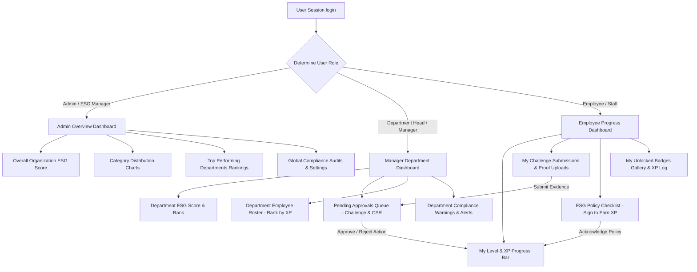

# EcoSphere Role-Based System Workflow Guide

This guide details the complete system architecture, operations, and database synchronization workflows implemented for the **Admin**, **Manager (Department Head)**, and **Employee** roles inside EcoSphere.

---

## 1. System Architecture & Operation Flow

---

## 2. Alternate Role Dashboard Workflows

### A. Employee User Journey
1. **Track Level & XP Progress**:
   - The top card displays the employee's current level (automatically calculated as `floor(XP / 100) + 1`) and a progress bar showing progress toward the next level (`XP % 100`).
2. **Review & Sign Policies**:
   - The **ESG Policy Checklist** reads published policies from the `policies` table and compares them with the employee's signed records in `policy_acknowledgements`.
   - Clicking **"Sign (+5 XP)"** triggers a server action that logs the signature with an IP address stamp, calls `awardXp` to add **+5 XP / Points** dynamically to their profile, and updates the checklist instantly.
3. **Submit Evidence for Challenges**:
   - In **My Challenge Submissions**, the employee views active challenges.
   - If they have not uploaded proof yet, they can enter an evidence link or text detail and click **"Submit Proof"**. This sets their status to `"pending"`, uploads the evidence, and sends it to their department manager's queue.
4. **Earn Badges & View XP Log**:
   - The dashboard dynamically queries `userBadges` and displays unlocked achievements (e.g. "Green Warrior") alongside a transaction ledger of historical XP earnings.

### B. Manager (Department Head) User Journey
1. **Monitor Department Health**:
   - The manager views the score of their assigned department (from `departmentScores` for the current period `2026-Q2`) and the department's corporate rank (e.g., `#3 in Company`).
2. **Queue Approvals**:
   - Under **Pending Approvals Queue**, the manager sees submissions only from employees who belong to their same department (`departmentId`).
   - The queue separates **CSR Participations** and **Challenge Completion** submissions, displaying employee names, evidence text/proof links, and dates.
3. **Approve / Reject Actions (Dynamic Sync)**:
   - **Approve**: Clicking "Approve" runs a transaction that updates the participation status to `"approved"`, triggers `awardXp` to award challenge XP (e.g., `+100 XP`) or CSR participation XP (`+50 XP`), deducts reward stock if applicable, and updates the leaderboard.
   - **Reject**: Clicking "Reject" updates the status to `"rejected"`.
4. **Audit and Compliance Management**:
   - The manager views all active compliance warnings and audits assigned to their department.

### C. Admin & ESG Manager Journey
- Admins retain access to global configurations (Category, Department, and Emission Factor settings), organization-wide charts (overall ESG trends, score distributions, and recent carbon transactions), and can generate unified company reports.

---

## 3. Database Synchronization Logic

- **XP & Leveling Idempotency**:
  - All XP transactions are logged in the `user_xp` ledger. To prevent double-awarding of points when approving challenges or signing policies, the system uses the record ID of the action (e.g. participation ID or acknowledgement ID) as a unique `referenceId` constraint.
- **Badge Auto-Awarding**:
  - The `awardXp` function automatically tests active badges rule thresholds (e.g. XP threshold reached, or count of approved challenges reached). If the user meets the unlock criteria, a new badge entry is logged in `user_badges` and an in-app system notification is fired.
- **Department Metrics Rollup**:
  - Submitting data updates the individual employee's points, which rolls up to compute the department average XP and is factored into overall department ESG scores.
